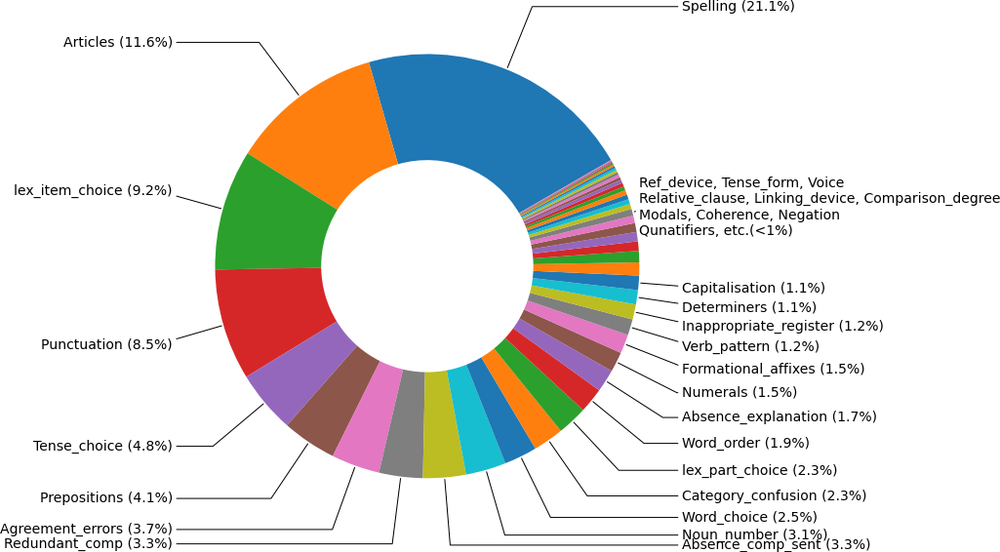

# Corpora-manipulation

Tool for converting Russian Error-Annotated Learner English Corpus to parallel dataset specifying error type.

# REALEC error types

Detailed description and erroneous sentences examples can be found in the [manual](https://realec.org/REALEC_annotation_manual.pdf).
Covered error types:

	Punctuation
	Spelling
	Capitalisation
	Grammar
		Determiners
			Articles
		Quantifiers
		Verbs
			Tense
				Choice of tense
				Tense form
			Voice
			Modals
			Verb pattern
			Gerund or participle construction
			Infinitive construction
		Nouns
			Countable/uncountable nouns
			Prepositional noun
			Possessive form of noun
			Noun+infinitive
			Noun number
		Prepositions
		Conjunctions
		Adjectives
			Prepositional adjective
			Adjective as collective noun
		Adverbs
			Prepositional adverb
		Degree of comparison
		Numerals
		Pronouns
		Agreement
		Word order
		Relative clauses
		Parallel construction
		Negation
		Comparative construction
		Confusion of structures
	Vocabulary
		Word choice
			Choice of lexical item
			Change, deletion or addition of part of lexical item
		Derivation
			Formational affixes
			Confusion of category
			Compound word
	Discourse
		Referential device
		Coherence


Errors distribution (```Exam*``` folders):





# Example usage

_Clone repo, install requirements_
```
git clone https://github.com/upunaprosk/corpora-manipulation
cd corpora-manipulation
python -m venv corpora-manipulation
source ./corpora-manipulation/bin/activate #Windows: corpora-manipulation\Scripts\activate
pip install -r ./requirements.txt
```
_Download corpus_  
Execute the following commands to get up-to-date [Russian Error-Annotated Learner English Corpus](https://realec.org):
```
eval {mkdir,cd}\ realec_data\;
wget -q 'https://realec.org/ajax.cgi?action=downloadCollection&collection=%2Fexam%2F&protocol=1' -O exam.tar.gz
tar xzvf exam.tar.gz --strip-components=1 -C . --wildcards 'exam/Exam*'
cd ..
```
or download it [manually](https://realec.org).   
*Files with relevant annotations and error tags are in the folders __Exam2014__...__Exam2020__*


_Parse&save parallel dataset_

Run ```parse.py``` specifying error tag and sentencize options: 
```
python parse.py -error_type=numerals --sentencize
```
The output file (```.*error_type.pickle```) would contain initial&corrected texts and number of corrections (if the option ```--no-sentencize``` is passed).

**Options** 

```
optional arguments:
  -h, --help            show this help message and exit
  -error_type ERROR_TYPE
  --sentencize, --no-sentencize
  --input_dir INPUT_DIR
                        Input directory (default: realec_data)
  --output_dir OUTPUT_DIR
                        Output directory (default: realec_parallel)
```
*Note:```sentencize``` option is more relevant to use for less context-dependent errors, e.g. capitalisation, spelling, numerals (not Inappropriate_register or Confusion_of_structures).*

**Error type possible options**
```
Punctuation
Spelling
Capitalisation
Articles
Quantifiers
Tense_choice
Tense_form
Voice
Modals
Verb_pattern
Participial_constr
Infinitive_constr
Nouns
Countable_uncountable
Prepositional_noun
Possessive
Noun_number
Prepositions
Conjunctions
Adjectives
Prepositional_adjective
Adverbs
Numerals
Pronouns
Agreement_errors
Word_order
Relative_clause
Lack_par_constr
Negation
Comparative_constr
Confusion_of_structures
Word_choice
lex_item_choice
lex_part_choice
Derivation
Formational_affixes
Category_confusion
Compound_word
Discourse
Ref_device
Coherence
Linking_device
Inappropriate_register
Absence_comp_sent
Redundant_comp
Absence_explanation
```

Leave created virtual environment: ```deactivate```
